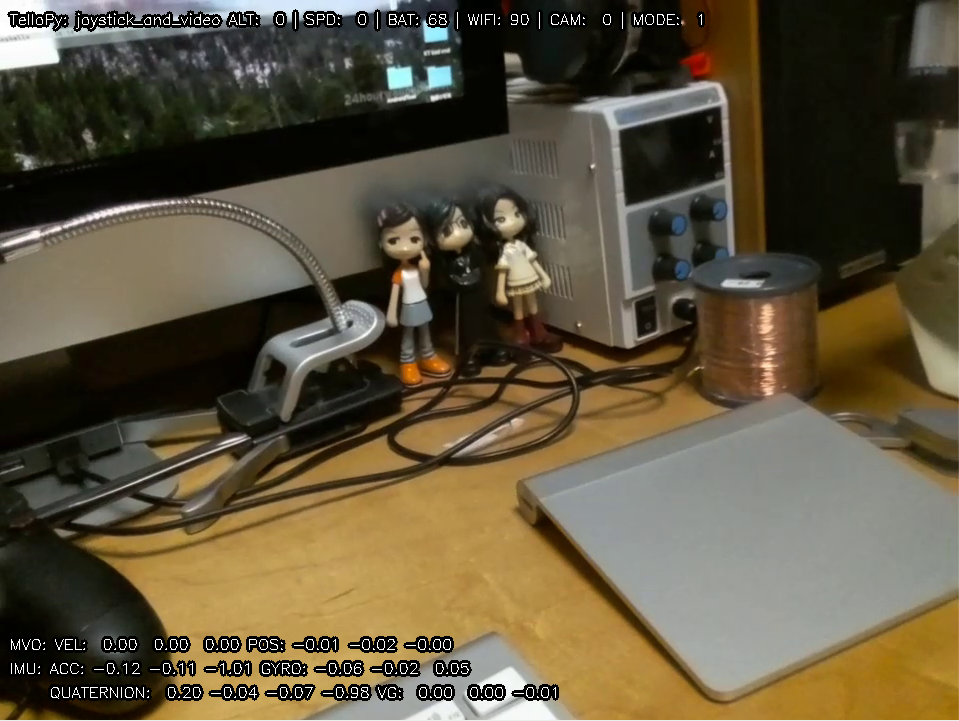

# DJI Tello drone controller python package

This is a python package which controlls DJI toy drone 'Tello'. The major portion of the source
code was ported from the driver of GOBOT project. For original golang version and protocol in
detail, please refer their blog post at
https://gobot.io/blog/2018/04/20/hello-tello-hacking-drones-with-go


## How to install
You can install stable version from PyPI.
```
$ pip install tellopy
```
Or install from the source code.
```
$ git clone https://github.com/hanyazou/TelloPy 
$ cd TelloPy
$ python setup.py bdist_wheel
$ pip install dist/tellopy-*.dev*.whl --upgrade
```

## Documents
Please see the API docstring.
```
$ python
>>> import tellopy
>>> help(tellopy)
Help on package tellopy:
...
```

## Examples
You can find basic usage of this package in example code in the examples folder.

### Mplayer
The examples assume that you have mplayer installed and configured in your path.

#### Windows
Download Mplayer for Windows from [SourceForge](https://sourceforge.net/projects/mplayerwin/files/MPlayer-MEncoder/r38151/mplayer-svn-38151-x86_64.7z/download).

Unzip the file via [7zip](https://www.7-zip.org/), and the extracted folder to your PATH (see [here for env help](https://www.architectryan.com/2018/03/17/add-to-the-path-on-windows-10/)).

#### Linux
`$ sudo apt install mplayer mplayer-gui`

#### Mac
`$ brew install mplayer`

### simple_takeoff
This example let Tello take off. Tello will land automatically after a few seconds.

```
$ python -m tellopy.examples.simple_takeoff
```

### keyboard_and_video
Display the realtime video stream from Tello.
```
$ pip install av
$ pip install opencv-python
$ pip install image
$ pip install pygame
$ python -m tellopy.examples.keyboard_and_video
```

### video_effect
Filter and display the realtime video stream from Tello.
```
$ pip install av
$ pip install opencv-python
$ pip install image
$ python -m tellopy.examples.video_effect
```


### joystick_and_video
You can use PS3/PS4/XONE joystick to controll Tello.
(see my video https://www.youtube.com/watch?v=MWdNFRdRuj8)
```
$ pip install av
$ pip install opencv-python
$ pip install image
$ pip install pygame
$ python -m tellopy.examples.joystick_and_video

```


## Tellopy side projects

### Hand_motion Tello controller

You can find a hand_motion controller for the Tello in this project: https://github.com/GalBrandwine/HalloPy,
and controll your tello using hand movements!

###  OpenCV based Tello controller

This interfaces with the drone through openCV and generates frames from the video stream for computer vision applications. It comes with a tracker that will detect a color in the scene and follow it:
https://github.com/Ubotica/telloCV/
 
