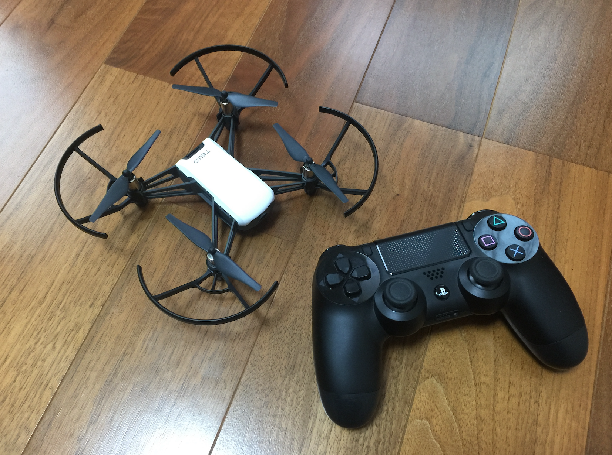
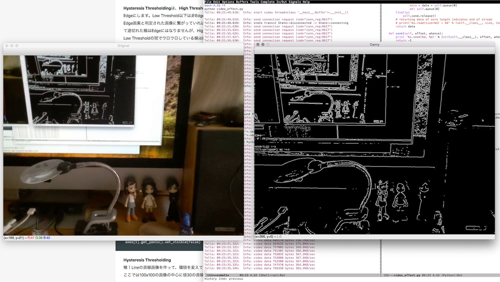

# DJI Tello drone controller python package

This is a python package which controlls DJI toy drone 'Tello'. The major portion of the source
code was ported from the driver of GOBOT project. For original golang version and protocol in
detail, please refer their blog post at
https://gobot.io/blog/2018/04/20/hello-tello-hacking-drones-with-go



## How to install
You can install stable version from PyPI.
```
$ pip install tellopy
```
Or install from the source code.
```
$ git clone https://github.com/hanyazou/TelloPy 
$ cd TelloPy
$ python setup.py bdist_wheel
$ pip install dist/tellopy-0.2.0.dev*.whl --upgrade
```

## Documents
Please see the API docstring.
```
$ python
>>> import tellopy
>>> help(tellopy)
Help on package tellopy:
...
```

## Examples

You can find basic usage of this package in example code in the examples folder.

### simple_takeoff
This example let Tello take off. Tello will land automatically after a few seconds.

```
$ python -m tellopy.examples.simple_takeoff
```

### video_effect
Filter and display the realtime video stream from Tello.
```
$ pip install av
$ pip install opencv-python
$ pip install image
$ python -m tellopy.examples.video_effect
```


### joystick_and_video
You can use PS3/PS4/XONE joystick to controll Tello.
(see my video https://www.youtube.com/watch?v=MWdNFRdRuj8)
```
$ pip install pygame
$ python -m tellopy.examples.joystick_and_video
```
