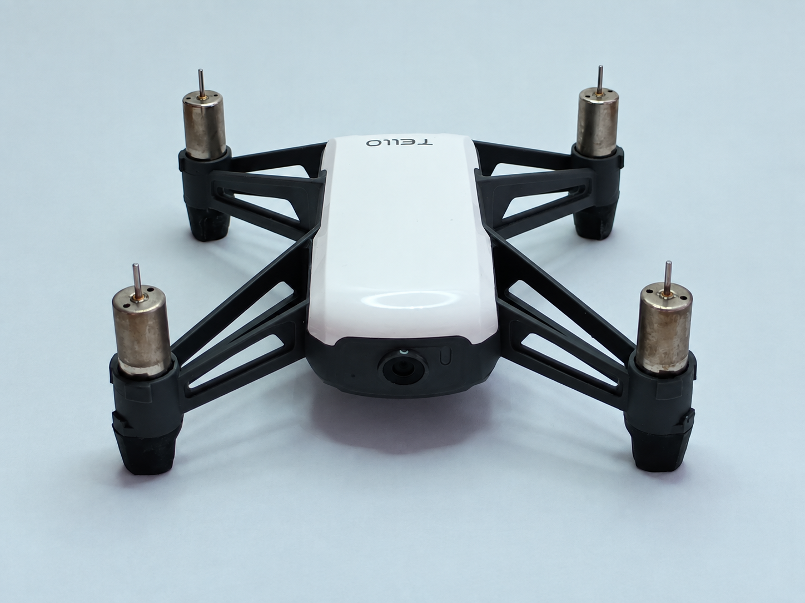
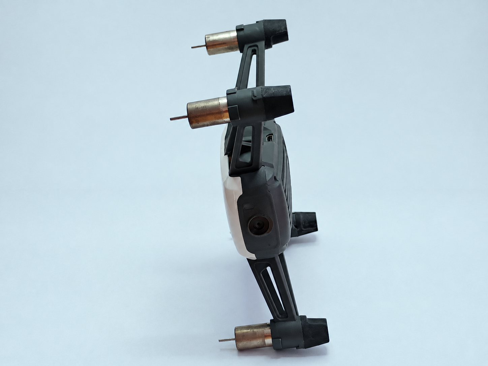
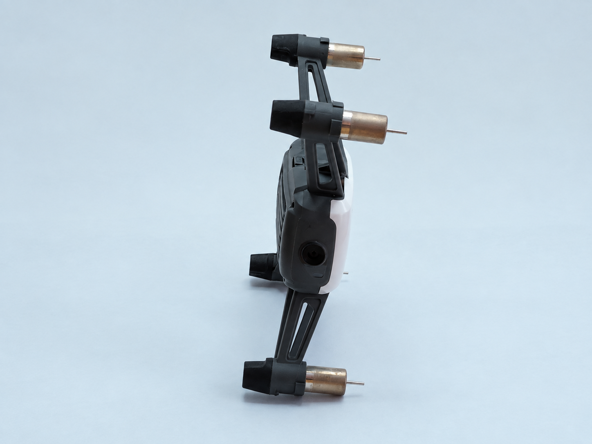
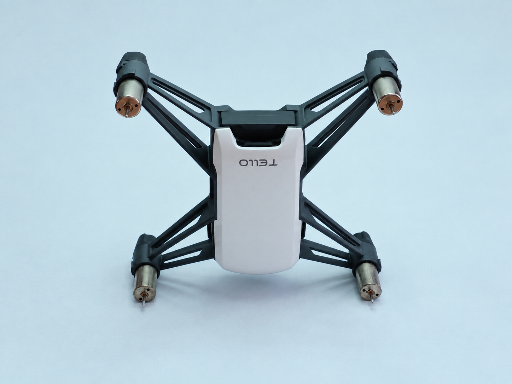
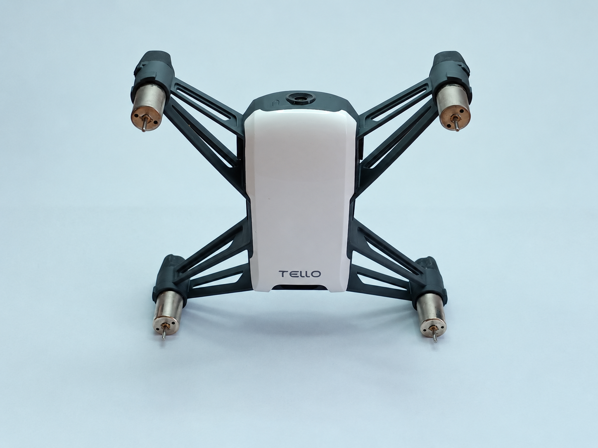
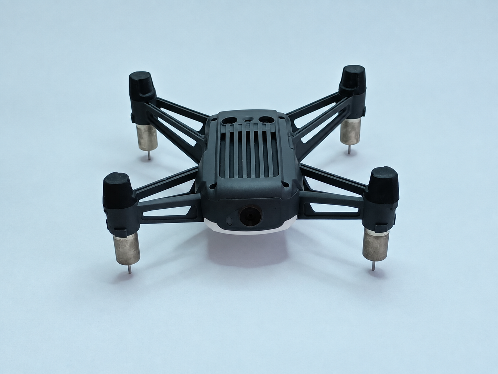

# IMU calibration

If the Tello app shows "Sensor Error" and won't fly, calibrate the IMU in
the app (Settings > More > IMU > Calibrate).

If instead you're driving the drone with TelloPy and see `imu_state=1` in
`FlightData` while the drone is sitting still and not flying, calibration
can fix that too. To check: subscribe to `EVENT_FLIGHT_DATA` and look at
`data.imu_state` --

```python
def handler(event, sender, data, **args):
    if event is sender.EVENT_FLIGHT_DATA:
        print("imu_state=%d" % data.imu_state)

drone.subscribe(drone.EVENT_FLIGHT_DATA, handler)
```

`imu_state` is bit 0 of the status byte at `FlightData` offset 10 (see
`tellopy/_internal/protocol.py`); `1` means the IMU hasn't established a
valid attitude/gravity reference yet. It's normal for this to be `1`
briefly after power-on, but if it stays `1` while the drone is resting
still and refuses to take off, that's the same condition the app's
"Sensor Error" reports.

TelloPy can run the calibration itself, without the official app. The
drone runs the whole multi-orientation sequence autonomously once started
-- you just physically hold it in a few different orientations by hand
while `Tello` handles the wire protocol and reports progress via
`EVENT_CALIBRATION_STATUS`. See `tellopy/examples/calibrate.py` for a
minimal working example; the rest of this document is the manual procedure
to follow while that example (or your own code calling
`start_calibration()`) is running.

## Before you start

- Battery at least 50%.
- Propellers off is recommended, especially the first time you try this.
  Calibration itself doesn't arm the motors, but there's no harm in being
  cautious while poking at an undocumented protocol.
- A flat, level, hard surface for the resting orientation.
- Only one client can be connected to the drone's Wi-Fi at a time -- make
  sure the official app isn't also connected.

## Running it

```
python3 -m tellopy.examples.calibrate
```

This connects to the drone and starts calibration. It just prints
progress; it does not tell you when to move the drone, because the drone
itself does that with its LED:

- **Yellow, steady on**: calibrating, current orientation not yet accepted.
- **Green, fast blink**: the current orientation was just accepted -- move
  the drone to a new, clearly different orientation and hold it still.
- Back to normal blinking (e.g. yellow slow blink): calibration finished.

You need to present roughly six distinct orientations, e.g. (this is the
official app's order; see the note below about order not mattering):

<table>
<tr>
<td width="33%"></td>
<td width="33%"></td>
<td width="33%"></td>
</tr>
<tr>
<td width="33%">1. Belly down (resting; usually already satisfied just by sitting on the table when you start)</td>
<td width="33%">2. Right side down</td>
<td width="33%">3. Left side down</td>
</tr>
<tr>
<td width="33%"></td>
<td width="33%"></td>
<td width="33%"></td>
</tr>
<tr>
<td width="33%">4. Nose down</td>
<td width="33%">5. Nose up</td>
<td width="33%">6. Upside down</td>
</tr>
</table>

The order does not matter -- this was verified by deliberately doing
them in a scrambled order and still reaching a complete, flight-ready
calibration. What matters is holding each orientation still for a couple
of seconds until the LED confirms it (green fast blink), same as with the
official app. Also note: the very first checkpoint (going from progress
94-95%, see below) always coincided with the drone's plain resting
orientation on a flat surface across every run so far -- if you start
calibration with the drone already sitting flat, that first orientation is
likely covered before you even pick it up.

Terminal output looks like:

```
progress= 95% steps=1/6 (mask=0b010000) raw=00 10 00 5f 00
progress= 96% steps=1/6 (mask=0b010000) raw=00 10 00 60 00
progress= 96% steps=2/6 (mask=0b010100) raw=00 14 00 60 00
...
progress=100% steps=6/6 (mask=0b111111) raw=00 3f 00 64 00
Calibration complete.
```

**Power-cycling the drone required after calibration.**

`steps=N/6` is our best guess at how many distinct orientations the drone
has accepted so far (a bitmask, not a simple counter -- see the
`CalibrationStatus` docstring in `tellopy/_internal/protocol.py`; it is
*not* the 6 IMU axes -- 3 accelerometer + 3 gyro -- despite also topping
out at 6, that would be a coincidence with no evidence behind it). The
official app shows this same count as "Calibrating. Please wait. N/6".
`progress` is a coarser, separate 0-100 score; the two don't always update
in lockstep since both are only sampled by polling at ~5Hz, but completion
(`progress=100`) and `steps=6/6` have always coincided in testing so far.
When `progress` reaches 100, the script exits its wait loop on its own.
